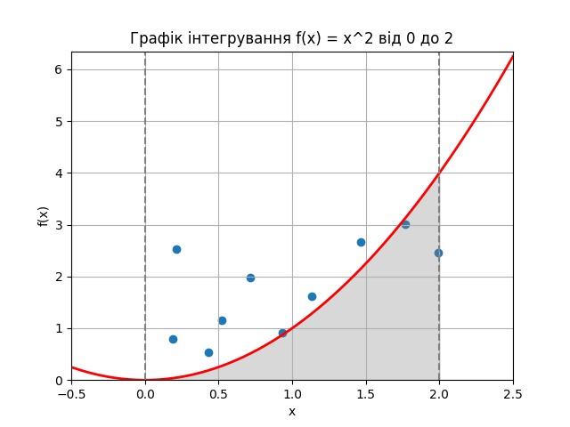

# ДЗ10: Лінійне програмування та рандомізовані алгоритми

### Результати розрахунку площі методом Монте-Карло за різної кількості випробувань:

Площа фігури, розрахована теоретично через визначений інтеграл: 2.666666666666667

Площа прямокутника, в який вписана фігура = 2 x 4 = 8

**___________________________________________________________________________________**

Кількість випробувань: 10

Кількість влучань у фігуру: 2

Частка влучань у фігуру: 0.2

Площа фігури, розрахована практично методом Монте-Карло: 1.6

Відхилення результату за методом Монте-Карло від результату за методом визначних інтегралів: -40%

Кількість випробувань: 100

Кількість влучань у фігуру: 29

Частка влучань у фігуру: 0.29

Площа фігури, розрахована практично методом Монте-Карло: 2.32

Відхилення результату за методом Монте-Карло від результату за методом визначних інтегралів:-13%

Кількість випробувань: 1000

Кількість влучань у фігуру: 340

Частка влучань у фігуру: 0.34

Площа фігури, розрахована практично методом Монте-Карло: 2.72

Відхилення результату за методом Монте-Карло від результату за методом визначних інтегралів: 2%

Кількість випробувань: 10000

Кількість влучань у фігуру: 3365

Частка влучань у фігуру: 0.3365

Площа фігури, розрахована практично методом Монте-Карло: 2.692

Відхилення результату за методом Монте-Карло від результату за методом визначних інтегралів: 1%

Кількість випробувань: 100000

Кількість влучань у фігуру: 33428

Частка влучань у фігуру: 0.33428

Площа фігури, розрахована практично методом Монте-Карло: 2.67424

Відхилення результату за методом Монте-Карло від результату за методом визначних інтегралів: 0%

Кількість випробувань: 1000000

Кількість влучань у фігуру: 334341

Частка влучань у фігуру: 0.334341

Площа фігури, розрахована практично методом Монте-Карло: 2.674728

Відхилення результату за методом Монте-Карло від результату за методом визначних інтегралів: 0%

### Висновки
1. Застосування методу Монте-Карло дозволяє приблизно визначити площу фігури навіть за мінімальної кількості випробувань.
2. Збільшення кількості випробувань збільшує точність розрахунку методом Монте-Карло.
3. Надмірне (стособно цього прикладу) збільшення кількості випробувань (> 100000) збільшує точність розрахунко несуттєво. Якщо досягнута необхідна точність, то немає сенсу збільшувати кількість випробувань.
